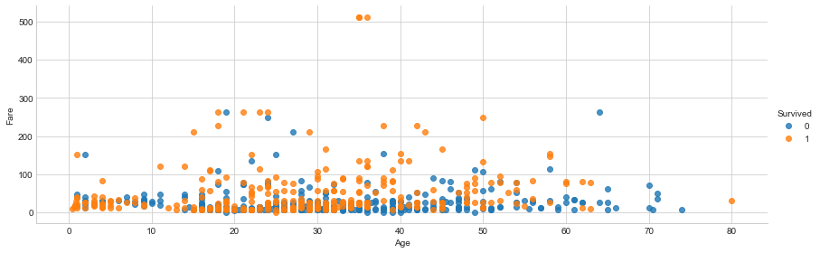
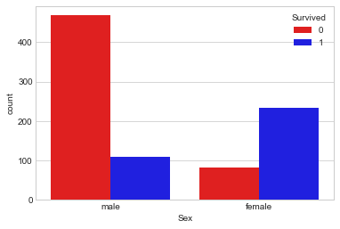

# Journey through *Titanic: Machine Learning from Disaster*

### My first Kaggle Kernel

Yes, like most of you guys I started with the Titanic competition. I learned a lot and realized that there is much to learn, and i find this exciting. As these were my first experiences with Kaggle I would like to share them in my first Kaggle Kernel.


```python
import pandas as pd
from matplotlib import pyplot as plt
import seaborn as sns
from sklearn.linear_model import LogisticRegression
from math import isnan
from sklearn.model_selection import RepeatedKFold
import numpy as np
sns.set_style("whitegrid")
```


```python
df = pd.DataFrame(pd.read_csv('train.csv'))
df_test = pd.DataFrame(pd.read_csv('test.csv'))
```


```python
df.head()
```


<div>
<style scoped>
    .dataframe tbody tr th:only-of-type {
        vertical-align: middle;
    }

    .dataframe tbody tr th {
        vertical-align: top;
    }

    .dataframe thead th {
        text-align: right;
    }
</style>
<table border="1" class="dataframe">
  <thead>
    <tr style="text-align: right;">
      <th></th>
      <th>PassengerId</th>
      <th>Survived</th>
      <th>Pclass</th>
      <th>Name</th>
      <th>Sex</th>
      <th>Age</th>
      <th>SibSp</th>
      <th>Parch</th>
      <th>Ticket</th>
      <th>Fare</th>
      <th>Cabin</th>
      <th>Embarked</th>
    </tr>
  </thead>
  <tbody>
    <tr>
      <th>0</th>
      <td>1</td>
      <td>0</td>
      <td>3</td>
      <td>Braund, Mr. Owen Harris</td>
      <td>male</td>
      <td>22.0</td>
      <td>1</td>
      <td>0</td>
      <td>A/5 21171</td>
      <td>7.2500</td>
      <td>NaN</td>
      <td>S</td>
    </tr>
    <tr>
      <th>1</th>
      <td>2</td>
      <td>1</td>
      <td>1</td>
      <td>Cumings, Mrs. John Bradley (Florence Briggs Th...</td>
      <td>female</td>
      <td>38.0</td>
      <td>1</td>
      <td>0</td>
      <td>PC 17599</td>
      <td>71.2833</td>
      <td>C85</td>
      <td>C</td>
    </tr>
    <tr>
      <th>2</th>
      <td>3</td>
      <td>1</td>
      <td>3</td>
      <td>Heikkinen, Miss. Laina</td>
      <td>female</td>
      <td>26.0</td>
      <td>0</td>
      <td>0</td>
      <td>STON/O2. 3101282</td>
      <td>7.9250</td>
      <td>NaN</td>
      <td>S</td>
    </tr>
    <tr>
      <th>3</th>
      <td>4</td>
      <td>1</td>
      <td>1</td>
      <td>Futrelle, Mrs. Jacques Heath (Lily May Peel)</td>
      <td>female</td>
      <td>35.0</td>
      <td>1</td>
      <td>0</td>
      <td>113803</td>
      <td>53.1000</td>
      <td>C123</td>
      <td>S</td>
    </tr>
    <tr>
      <th>4</th>
      <td>5</td>
      <td>0</td>
      <td>3</td>
      <td>Allen, Mr. William Henry</td>
      <td>male</td>
      <td>35.0</td>
      <td>0</td>
      <td>0</td>
      <td>373450</td>
      <td>8.0500</td>
      <td>NaN</td>
      <td>S</td>
    </tr>
  </tbody>
</table>
</div>


First we should do some initial exploratory data analysis:


```python
sns.lmplot(data = df, x = 'Age', y = 'Fare', hue = 'Survived', fit_reg = False, size = 4, aspect = 3)
plt.show()
```





```python
def countplot(var):
    sns.countplot(data = df, x = var, hue = 'Survived', palette = ('R', 'b'))
    plt.show()
countplot('Sex')
```





```python
countplot('Pclass')
```


```python
countplot('Embarked')
```


Okay, we can observe some things:

* the age-fare plot shows a distributed result, but some differences are evident on the extreme values.
* being a man from 3rd class that embarked on 'S' may not be very good. 
* most of the passengers were men from 3rd class that embarked on 'S'.

Now, let's take a look at the missing values and what to do with them.


```python
df.isnull().sum()
```


    PassengerId      0
    Survived         0
    Pclass           0
    Name             0
    Sex              0
    Age            177
    SibSp            0
    Parch            0
    Ticket           0
    Fare             0
    Cabin          687
    Embarked         2
    dtype: int64


## Missing Values

Let's handle the **Age** missing values first. We could just fill with -1 or with the mean, but I think we can be more careful. 

We will calculate the **Age** mean of each **Pclass** and **Sex** and fill the NaN values with them.


```python
print(df.groupby(['Pclass']).mean()['Age'])
print('\n')
print(df.groupby(['Sex']).mean()['Age'])
```

    Pclass
    1    38.233441
    2    29.877630
    3    25.140620
    Name: Age, dtype: float64
    
    
    Sex
    female    27.915709
    male      30.726645
    Name: Age, dtype: float64
    


```python
# fill NaN Age values with the means, separating by Sex and Pclass

def age_nan(df):
    for i in df.Sex.unique():
        for j in df.Pclass.unique():
            x = df.loc[((df.Sex == i) & (df.Pclass == j)), 'Age'].mean()
            df.loc[((df.Sex == i) & (df.Pclass == j)), 'Age'] = df.loc[((df.Sex == i) & (df.Pclass == j)), 'Age'].fillna(x)

age_nan(df)
age_nan(df_test)
```

There were just 2 NaN values on Embarked, so it's reasonable to fill them with Embarked's mode: **S**


```python
# fill NaN values of Embarked with 'S', because it's the most commom value for it

df['Embarked'] = df['Embarked'].fillna('S')
df_test['Embarked'] = df_test['Embarked'].fillna('S')
```

The **Cabin** feature has a significant number of NaN values, and my first thought was to drop the column. But we can extract some interesting info from this, from separating who had a specified Cabin and who didn't. So we created the **Cabin_NaN** feature, that returns 1 for NaN values. 


```python
#creating Cabin_NaN to test and train dataset and analysing it

df['Cabin_NaN'] = df['Cabin'].isnull().astype(int)
df_test['Cabin_NaN'] = df_test['Cabin'].isnull().astype(int)
countplot('Cabin_NaN')
```


Now we should handle the test dataset missing values as well. We found only 1 NaN value for Fare, that was filled with -1.


```python
df_test.isnull().sum()
```


    PassengerId      0
    Pclass           0
    Name             0
    Sex              0
    Age              0
    SibSp            0
    Parch            0
    Ticket           0
    Fare             1
    Cabin          327
    Embarked         0
    Cabin_NaN        0
    dtype: int64


```python
df_test.Fare = df_test.Fare.fillna(-1)
```

This function builds a Logistic Regression prediction model, make a cross validation and return the score. With it we can easily see, progressively, how the model improves as we create new features to feed the algorithm.


```python
# logistic regression - cross validation function

def reg_cross_val(variables):
    
    X = df[variables]
    y = df['Survived']
    
    rkfold = RepeatedKFold(n_splits = 2, n_repeats = 10, random_state = 10)
    result = []
    for treino, teste in rkfold.split(X):
        X_train, X_test = X.iloc[treino], X.iloc[teste]
        y_train, y_test = y.iloc[treino], y.iloc[teste]
        
        reg = LogisticRegression(max_iter = 500)
        reg.fit(X_train, y_train)
        result.append(reg.score(X_test, y_test))
        
    return np.mean(result)
```

Logistic Regression must "be fed" with numbers, not strings. So a new feature **Sex_bin** was created based on **Sex** info. 0 for male and 1 for female.


```python
#creating feature: Sex_bin

def is_female(x):
    if x == 'female':
        return 1
    else:
        return 0

df['Sex_bin'] = df['Sex'].map(is_female)
df_test['Sex_bin'] = df_test['Sex'].map(is_female)
```

Same thing with **Embarked**, but here we have 3 possible values, so features were created for S and C.

No, Q was not ignored. But it's logical that if someone didn't embark on S or C, surely did on Q.


```python
# creating features: Embarked_S and Embarked_C

def embarked_s(x):
    if x == 'S':
        return 1
    else:
        return 0

df['Embarked_S'] = df['Embarked'].map(embarked_s)
df_test['Embarked_S'] = df_test['Embarked'].map(embarked_s)

def embarked_c(x):
    if x == 'C':
        return 1
    else:
        return 0
    
df['Embarked_C'] = df['Embarked'].map(embarked_c)
df_test['Embarked_C'] = df_test['Embarked'].map(embarked_c)
```

## First try (with and without the created features):


```python
variables_before = ['Age', 'Pclass', 'Fare', 'SibSp', 'Parch']
print('Before the new features:', reg_cross_val(variables_before))

variables = ['Age', 'Sex_bin', 'Pclass', 'Fare', 'SibSp', 'Parch', 'Embarked_S',\
             'Embarked_C', 'Cabin_NaN']

print('With the new features:', reg_cross_val(variables))
```

    Before the new features: 0.7065029979341966
    With the new features: 0.8024593137501889
    

Ticket and Name features may have some interesting information as well. The most commom words or terms in them may give us some ideas.


```python
import re

text_ticket = ''
for i in df.Ticket:
    text_ticket += i
    
lista = re.findall('[a-zA-Z]+', text_ticket)
print('Most repeated terms in Tickets: \n')
print(pd.Series(lista).value_counts().head(10))
```

    Most repeated terms in Tickets: 
    
    C        63
    PC       60
    A        58
    O        37
    SOTON    18
    STON     18
    S        15
    W        13
    SC       13
    CA       13
    dtype: int64
    


```python
# creating features based on some commom words in Ticket feature

df['CA'] = df['Ticket'].str.contains('CA|C.A.').astype(int)
df['SOTON'] = df['Ticket'].str.contains('SOTON|STON').astype(int)
df['PC'] = df['Ticket'].str.contains('PC').astype(int)
df['SC'] = df['Ticket'].str.contains('SC|S.C').astype(int)
df['C'] = df['Ticket'].str.contains('C').astype(int)

# same with the df_test

df_test['CA'] = df_test['Ticket'].str.contains('CA|C.A.').astype(int)
df_test['SOTON'] = df_test['Ticket'].str.contains('SOTON|STON').astype(int)
df_test['PC'] = df_test['Ticket'].str.contains('PC').astype(int)
df_test['SC'] = df_test['Ticket'].str.contains('SC|S.C').astype(int)
df_test['C'] = df_test['Ticket'].str.contains('C').astype(int)
```


```python
text_name = ''
for i in df.Name:
    text_name += i
    
lista = re.findall('[a-zA-Z]+', text_name)
print('Most repeated words in Name column: \n')
print(pd.Series(lista).value_counts().head(10))
```

    Most repeated words in Name column: 
    
    Mr         521
    Miss       182
    Mrs        129
    William     49
    Master      40
    John        28
    Henry       19
    Thomas      17
    Charles     17
    George      16
    dtype: int64
    


```python
# creating features based on some commom words in Name feature

df['Master'] = df['Name'].str.contains('Master', regex = False).astype(int)
df['Mr'] = df['Name'].str.contains('Mr.').astype(int)
df['Miss'] = df['Name'].str.contains('Miss', regex = False).astype(int)
df['Mrs'] = df['Name'].str.contains('Mrs', regex = False).astype(int)

#same with df_teste

df_test['Master'] = df_test['Name'].str.contains('Master', regex = False).astype(int)
df_test['Mr'] = df_test['Name'].str.contains('Mr', regex = False).astype(int)
df_test['Miss'] = df_test['Name'].str.contains('Miss', regex = False).astype(int)
df_test['Mrs'] = df_test['Name'].str.contains('Mrs', regex = False).astype(int)
```

### Second try:


```python
variables = ['Age', 'Sex_bin', 'Pclass', 'Fare','SibSp', 'Parch', 'Embarked_S','Embarked_C',\
             'CA', 'SOTON', 'PC', 'SC','C', 'Mr', 'Miss', 'Master', 'Mrs']

print(reg_cross_val(variables))
```

    0.8250186426160125
    

Okay, we had a little improvement on our validation here.

Finally, it seems reasonable to merge **SibSp** and **Parch** features into 1: **Family**. But it's yet more reasonable if we check that visualy before doing anything, so let's make some late exploratory data analysis here:


```python
fig, ax =plt.subplots(1,2)
sns.countplot(data = df, x = 'SibSp', hue = 'Survived', palette = ('R', 'b'), ax = ax[0])
sns.countplot(data = df, x = 'Parch', hue = 'Survived', palette = ('R', 'b'), ax = ax[1])
plt.show()
```


```python
# creating 'Family':

df['Family'] = df.SibSp + df.Parch
df_test['Family'] = df_test.SibSp + df_test.Parch
```


```python
# with Family
variables = ['Age', 'Sex_bin', 'Pclass', 'Fare','Family', 'Embarked_S','Embarked_C',\
             'CA', 'SOTON', 'PC', 'SC','C', 'Mr', 'Miss', 'Master', 'Mrs']

print(reg_cross_val(variables))
```

    0.8258041517609713
    


```python
df['Alone'] = 0
df.loc[df.Family == 0, 'Alone'] = 1

df_test['Alone'] = 0
df_test.loc[df.Family == 0, 'Alone'] = 1
```


```python
countplot('Family')
```


```python
# with Family
variables = ['Age', 'Sex_bin', 'Pclass', 'Fare','Alone','Family', 'Embarked_S','Embarked_C',\
             'CA', 'SOTON', 'PC', 'SC','C', 'Mr', 'Miss', 'Master', 'Mrs']

print(reg_cross_val(variables))
```

    0.8249060311382074
    

## Submiting


```python
variables = ['Age', 'Sex_bin', 'Pclass', 'Fare','Family', 'Embarked_S','Embarked_C','Cabin_NaN',\
             'CA', 'SOTON', 'PC', 'SC', 'Master', 'Mr', 'Miss', 'C', 'Mrs']

X = df[variables]
y = df['Survived']

reg = LogisticRegression(max_iter = 1000)
reg.fit(X,y)
resp = reg.predict(df_test[variables])

submit = pd.Series(resp, index=df_test['PassengerId'], name='Survived')
submit.to_csv("model3.csv", header=True)
```


```python
from sklearn.model_selection import cross_val_score

score = cross_val_score(reg, X, y, cv = 20)
```


```python
score.mean()
```


    0.8327119016249451


